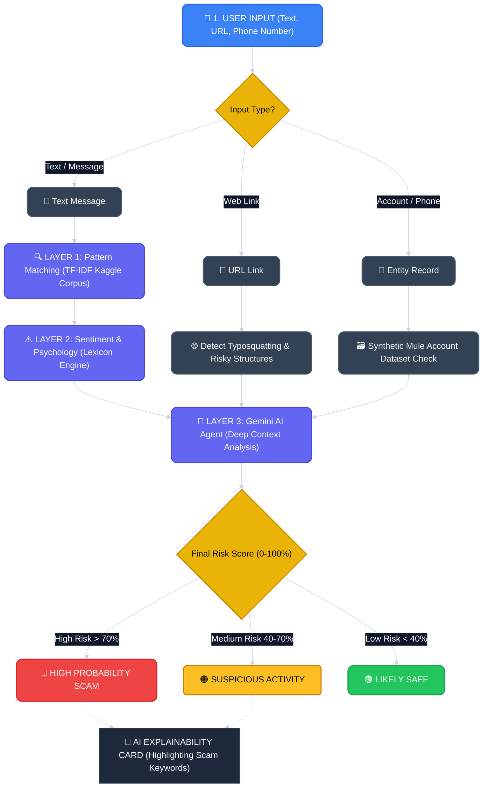

# 🛡️ ScamShield MY Workflow Infographic

Here is the visual workflow for ScamShield MY, illustrating how input is processed from the initial stage through to the final result generation and AI explainability.

> [!NOTE]  
> The chart above summarizes the data flow that we will build in **Vanilla JavaScript** (for Layer 1 and 2) up to the API integration (for Layer 3).
