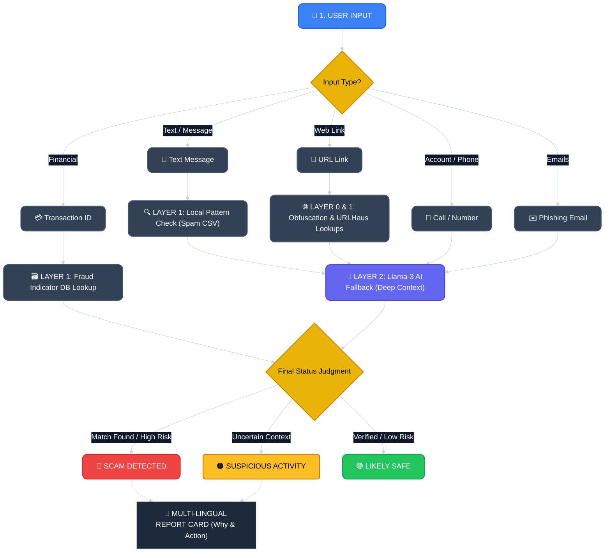

# 🛡️ ScamShield MY Workflow Infographic

Here is the visual workflow for ScamShield MY, illustrating how input is processed from the initial stage through to the final result generation and AI explainability. This workflow has been updated to include full dataset integration including transactions and emails.

> [!NOTE]  
> The chart above outlines the comprehensive 3-stage validation process that routes offline/locally cached logic (Layer 0 and 1) swiftly, preserving standard rate limits by only pinging Groq's Llama-3 AI Engine (Layer 2) when processing nuanced structures like Emails and Social Engineering patterns.
